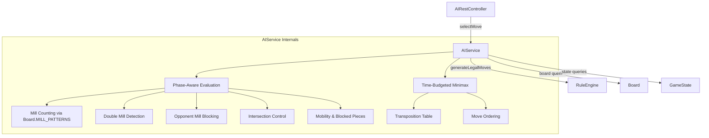

# Design Document: AI Strategy Rework

## Overview

This design overhauls the AI evaluation function and search strategy in `AIService.java` to produce a significantly harder Nine Men's Morris opponent. The current AI suffers from several weaknesses:

1. **Inconsistent mill patterns** — `AIService.countMills()` and `countPotentialMills()` hardcode their own 16-entry mill pattern arrays that differ from `Board.MILL_PATTERNS`. This causes the AI to miscount mills.
2. **Weak evaluation weights** — Mills are weighted at 50 vs. piece count at 100, meaning the AI values a single piece advantage more than forming a mill (which lets you *remove* a piece).
3. **No phase awareness** — The same weights apply in placement, movement, and flying phases despite radically different strategic priorities.
4. **No double mill detection** — The AI has no concept of the devastating double mill configuration.
5. **No explicit opponent mill blocking** — Opponent potential mills are subtracted but at a trivially low weight (10), so the AI rarely blocks.
6. **No intersection control** — During placement, the AI doesn't prioritize the 8 high-connectivity positions.
7. **No time budget** — The search runs to completion with no fallback if it exceeds 2 seconds.

The rework addresses all of these while preserving the existing minimax + alpha-beta + transposition table architecture. Changes are confined to `AIService.java` — no changes to `Board`, `GameState`, `RuleEngine`, or the REST layer.

## Architecture

The overall architecture remains unchanged: a Spring `@Service` with minimax + alpha-beta pruning, transposition table, and move ordering. The changes are internal to `AIService`:



Key architectural decisions:

1. **Single-class refactor** — All changes stay within `AIService.java`. The `Board`, `GameState`, and `RuleEngine` APIs are sufficient; no new classes are needed.
2. **Delegate mill patterns to Board** — Replace hardcoded arrays with `Board.getMillPatterns()` calls, establishing a single source of truth.
3. **Phase-weight lookup** — A simple `PhaseWeights` record holds per-phase weight tuples. The evaluation function selects the appropriate tuple based on `state.getPhase()`.
4. **Time-budgeted search** — A `deadline` field (set at the start of `selectMove`) is checked at each minimax node. If exceeded, the search returns the best move found so far.

## Components and Interfaces

### Modified: `AIService`

The public API remains identical — `selectMove(GameState, PlayerColor)` and `evaluatePosition(GameState, PlayerColor)`. Internal changes:

#### New Constants and Records

```java
// Phase-specific weight configurations
private record PhaseWeights(
    int pieceCount,
    int mill,
    int potentialMill,
    int opponentPotentialMill,
    int doubleMill,
    int mobility,
    int blockedPiece,
    int intersection
) {}

private static final PhaseWeights PLACEMENT_WEIGHTS = new PhaseWeights(
    100,  // pieceCount
    200,  // mill (2x piece count — requirement 2.1: at least 1.5x)
    80,   // potentialMill (40% of mill — requirement 2.2: at least 30%)
    80,   // opponentPotentialMill (equal to own — requirement 5.3)
    500,  // doubleMill (2.5x mill — requirement 2.4: at least 2x)
    3,    // mobility (low in placement — pieces go anywhere)
    0,    // blockedPiece (irrelevant during placement)
    15    // intersection (requirement 6.1)
);

private static final PhaseWeights MOVEMENT_WEIGHTS = new PhaseWeights(
    100,  // pieceCount
    200,  // mill
    60,   // potentialMill (lower than placement — requirement 3.2)
    60,   // opponentPotentialMill
    500,  // doubleMill
    12,   // mobility (higher than placement — requirement 3.3)
    8,    // blockedPiece (higher than placement — requirement 3.3)
    0     // intersection (not relevant post-placement)
);

private static final PhaseWeights FLYING_WEIGHTS = new PhaseWeights(
    100,  // pieceCount
    300,  // mill (increased — requirement 3.5)
    60,   // potentialMill
    60,   // opponentPotentialMill
    600,  // doubleMill
    2,    // mobility (reduced — requirement 3.4: flying player can go anywhere)
    0,    // blockedPiece (irrelevant when flying)
    0     // intersection
);

// Time budget
private static final long TIME_BUDGET_MS = 2000;

// Intersection positions (3+ adjacencies)
private static final int[] INTERSECTION_POSITIONS = {1, 3, 5, 7, 9, 11, 13, 15};
```

#### Modified Methods

| Method | Change |
|--------|--------|
| `selectMove` | Record `deadline = System.nanoTime() + TIME_BUDGET_MS * 1_000_000`. Pass deadline to minimax. Track `bestMoveSoFar`. Return best move if deadline exceeded. |
| `minimax` | Accept `long deadline` parameter. Check `System.nanoTime() > deadline` at each node; if exceeded, return current evaluation immediately. |
| `evaluatePosition` | Select `PhaseWeights` based on `state.getPhase()`. Call new sub-evaluators. |
| `countMills` | Replace hardcoded array with `Board.getMillPatterns()`. |
| `countPotentialMills` | Replace hardcoded array with `Board.getMillPatterns()`. |

#### New Methods

| Method | Purpose |
|--------|---------|
| `countDoubleMills(Board, PlayerColor)` | Detects double mill configurations per requirement 4.4. |
| `evaluateDoubleMills(Board, PlayerColor, PlayerColor)` | Scores double mill advantage. |
| `evaluateOpponentBlocking(Board, PlayerColor, PlayerColor)` | Counts unblocked opponent potential mills and applies penalty. |
| `evaluateIntersectionControl(Board, PlayerColor, PlayerColor)` | Scores intersection occupancy during placement. |
| `getPhaseWeights(GamePhase)` | Returns the appropriate `PhaseWeights` for the current phase. |

### Unchanged Components

- **Board** — Already exposes `getMillPatterns()`, `isPartOfMill()`, `getAdjacentPositions()`, `getMillsForPlayer()`. No changes needed.
- **GameState** — Already exposes `getPhase()`, `getPiecesOnBoard()`, `isGameOver()`, `getWinner()`. No changes needed.
- **RuleEngine** — Already generates legal moves and validates them. No changes needed.
- **AIRestController** — Calls `aiService.selectMove()` which keeps the same signature. No changes needed.

## Data Models

No new data models are introduced. The existing `GameState`, `Board`, `Move`, `PlayerColor`, `GamePhase` classes are sufficient.

The only new type is the internal `PhaseWeights` record inside `AIService`, which is a simple value holder:

```java
private record PhaseWeights(
    int pieceCount,
    int mill,
    int potentialMill,
    int opponentPotentialMill,
    int doubleMill,
    int mobility,
    int blockedPiece,
    int intersection
) {}
```

### Double Mill Detection Algorithm

A double mill exists when a piece is part of a completed mill AND is adjacent to an empty position that, if the piece moved there, would complete a second mill. The algorithm:

```
for each position p occupied by player:
    if p is part of a completed mill:
        for each adjacent position a of p:
            if a is empty:
                // Simulate: move piece from p to a
                // Check if a is now part of a mill (with the piece at a, not p)
                // Also verify that moving from p doesn't break the original mill
                //   in a way that matters (the piece left p, so that mill is broken,
                //   but we're checking if a NEW mill forms at a)
                if placing player's piece at a would complete a mill:
                    doubleMill detected for player
```

This is O(24 * max_adjacency * 16_patterns) per call, which is negligible.

### Intersection Identification

Intersection positions are those with 3+ entries in `Board.getAdjacentPositions()`. On the standard board these are the 8 midpoint positions: `{1, 3, 5, 7, 9, 11, 13, 15}`. These are hardcoded as a constant since the board topology is fixed.


## Correctness Properties

*A property is a characteristic or behavior that should hold true across all valid executions of a system — essentially, a formal statement about what the system should do. Properties serve as the bridge between human-readable specifications and machine-verifiable correctness guarantees.*

### Property 1: Mill Count Consistency

*For any* board state and player color, the AI's internal mill count for that player must equal `Board.getMillsForPlayer(color).size()` on the same board.

**Validates: Requirements 1.1, 1.2**

### Property 2: Potential Mill Count Consistency

*For any* board state and player color, the AI's potential mill count must agree with a reference implementation that iterates over `Board.getMillPatterns()` and counts patterns with exactly 2 pieces of that color and 1 empty position.

**Validates: Requirements 1.3**

### Property 3: Weight Ratio Invariants

*For all* game phases, the following weight ratio constraints must hold simultaneously:
- `mill >= 1.5 * pieceCount` (Req 2.1)
- `potentialMill >= 0.3 * mill` (Req 2.2)
- `opponentPotentialMill > 0` (Req 2.3)
- `doubleMill >= 2.0 * mill` (Req 2.4)
- `opponentPotentialMill >= potentialMill` (Req 5.3)

**Validates: Requirements 2.1, 2.2, 2.3, 2.4, 5.3**

### Property 4: Phase Weight Ordering

*For all* phase weight configurations, the following cross-phase ordering constraints must hold:
- Placement `potentialMill` > Movement `potentialMill` AND Placement `potentialMill` > Flying `potentialMill` (Req 3.2)
- Movement `mobility` > Placement `mobility` AND Movement `blockedPiece` > Placement `blockedPiece` (Req 3.3)
- Flying `mobility` < Movement `mobility` (Req 3.4)
- Flying `mill` > Movement `mill` (Req 3.5)

**Validates: Requirements 3.2, 3.3, 3.4, 3.5**

### Property 5: Double Mill Detection Correctness

*For any* board state where a player has a piece that is part of a completed mill and is adjacent to an empty position that would complete a second mill, the double mill detection function must return a count of at least 1 for that player.

**Validates: Requirements 4.1, 4.4**

### Property 6: Double Mill Evaluation Impact

*For any* board state containing a double mill for one player, the evaluation function must return a higher score from the perspective of the player with the double mill than from the opponent's perspective (i.e., the double mill contributes positively to the owning player's evaluation).

**Validates: Requirements 4.2, 4.3**

### Property 7: Opponent Potential Mill Penalty

*For any* board state where the opponent has at least one potential mill, the AI's evaluation score must be lower than the evaluation of an otherwise identical board state where that potential mill is blocked by an AI piece.

**Validates: Requirements 5.1, 5.2**

### Property 8: Intersection Control Bonus During Placement

*For any* placement-phase board state, the evaluation score for the AI must increase when an AI piece occupies an intersection position compared to an equivalent state where that piece occupies a non-intersection position that is not part of a potential mill.

**Validates: Requirements 3.1, 6.1, 6.2**

### Property 9: Intersection Position Identification

*For all* 24 board positions, a position is classified as an intersection if and only if `Board.getAdjacentPositions(position).size() >= 3`. The set of intersection positions must equal `{1, 3, 5, 7, 9, 11, 13, 15}`.

**Validates: Requirements 6.3**

### Property 10: AI Move Legality

*For any* valid game state and AI color, `selectMove` must return either `null` (when no legal moves exist) or a move that is contained in `RuleEngine.generateLegalMoves(state, aiColor)` and accepted by `RuleEngine.isValidMove(state, move)`.

**Validates: Requirements 7.1, 7.2, 7.3**

### Property 11: AI Performance Constraint

*For any* valid game state, `selectMove` must return within 2000 milliseconds when using the default search depth.

**Validates: Requirements 8.1**

### Property 12: Transposition Table Caching

*For any* game state where legal moves exist, after `selectMove` completes, the transposition table size must be greater than 0.

**Validates: Requirements 8.3**

### Property 13: Evaluation Symmetry

*For any* valid board state, `evaluatePosition(state, WHITE)` must equal `-evaluatePosition(state, BLACK)`.

**Validates: Requirements 9.1, 9.2**

## Error Handling

The error handling strategy remains consistent with the existing codebase:

1. **Null inputs** — `evaluatePosition` and `selectMove` throw `IllegalArgumentException` for null `state` or `aiColor` parameters. This behavior is preserved.

2. **No legal moves** — When `RuleEngine.generateLegalMoves()` returns an empty list, `selectMove` returns `null`. The `AIRestController` handles this by returning HTTP 204 No Content.

3. **Time budget exceeded** — When the minimax search exceeds the 2-second deadline, the search terminates early and returns the best move found so far. If no move has been evaluated yet (extremely unlikely given the iterative structure), the first legal move is returned as a fallback.

4. **Transposition table overflow** — The existing `MAX_TRANSPOSITION_TABLE_SIZE` (100,000 entries) cap is preserved. Entries beyond this limit are simply not cached, which degrades performance gracefully without causing errors.

5. **Game-over states** — Terminal positions return extreme scores (±10000) as before. The evaluation function checks `state.isGameOver()` first and short-circuits.

6. **Invalid board positions** — Board index validation (0–23) is handled by `Board.getPosition()` which throws `IllegalArgumentException`. The AI never generates out-of-range indices since it iterates over the fixed 0–23 range.

## Testing Strategy

### Dual Testing Approach

Testing uses both unit tests (specific examples and edge cases) and property-based tests (universal properties across generated inputs).

### Unit Tests (JUnit 5)

Unit tests cover specific scenarios and edge cases:

- **Double mill scoring example** — A position with a double mill scores higher than two separate mills with the same piece count (Req 2.5).
- **Opponent mill blocking behavior** — In a placement-phase position where the opponent threatens a mill, the AI places at the blocking position (Req 5.4).
- **Time budget fallback** — The AI returns a valid move even when search is artificially constrained (Req 8.2).
- **Initial state evaluates to zero** — `evaluatePosition(initialState, WHITE) == 0` and `evaluatePosition(initialState, BLACK) == 0` (Req 9.2).

### Property-Based Tests (jqwik)

Each correctness property from the design is implemented as a single jqwik `@Property` test with a minimum of 100 iterations (`tries = 100`).

**Library:** jqwik (already in `pom.xml`)

**Generator strategy:** Random game states are generated by starting from an initial `GameState` and applying a random number (0–20) of random legal moves via `RuleEngine.generateLegalMoves()`. This produces realistic board positions across all three phases.

**Tag format:** Each test includes a comment: `Feature: ai-strategy-rework, Property {N}: {title}`

**Properties to implement:**

| Property | Test Method | Iterations |
|----------|-------------|------------|
| P1: Mill Count Consistency | `millCountMatchesBoardEngine` | 100 |
| P2: Potential Mill Count Consistency | `potentialMillCountMatchesReference` | 100 |
| P3: Weight Ratio Invariants | `weightRatiosSatisfyConstraints` | 100 |
| P4: Phase Weight Ordering | `phaseWeightOrderingHolds` | 100 |
| P5: Double Mill Detection | `doubleMillDetectedWhenPresent` | 100 |
| P6: Double Mill Evaluation Impact | `doubleMillFavorsOwner` | 100 |
| P7: Opponent Potential Mill Penalty | `opponentPotentialMillReducesScore` | 100 |
| P8: Intersection Control Bonus | `intersectionBonusInPlacement` | 100 |
| P9: Intersection Position Identification | `intersectionPositionsMatchAdjacency` | 100 |
| P10: AI Move Legality | `aiAlwaysSelectsLegalMove` | 100 |
| P11: AI Performance Constraint | `aiRespondsWithinTwoSeconds` | 100 |
| P12: Transposition Table Caching | `transpositionTablePopulatedAfterSearch` | 100 |
| P13: Evaluation Symmetry | `evaluationIsSymmetric` | 100 |

### Test Configuration

- jqwik `tries = 100` minimum per property
- Use `@Property(tries = 100)` annotation
- AI search depth reduced to 2 for property tests to keep execution time reasonable
- Performance property (P11) uses default depth 4 with 2-second assertion
- All property tests use the shared `gameStates()` generator from the existing `AIServiceTest`
