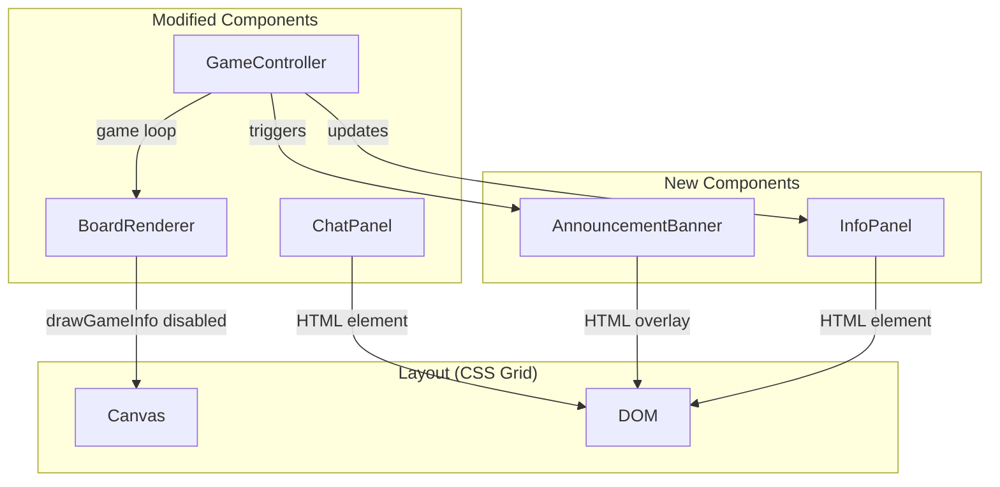
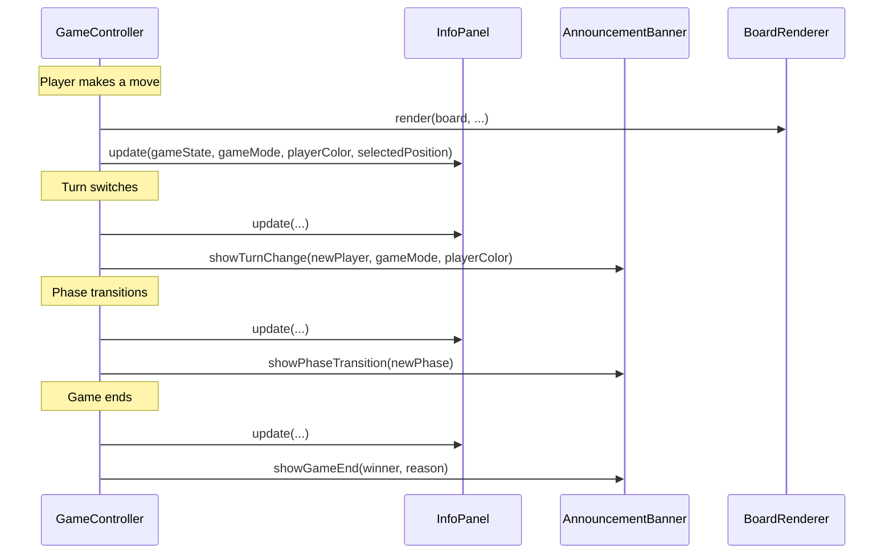

# Design Document: Game Status Display

## Overview

This feature replaces the canvas-drawn game info text with a structured HTML-based Info Panel, adds an Announcement Banner for key game events, provides contextual action instructions, and repositions the Chat Panel so it no longer overlaps the game board.

Currently, `BoardRenderer.drawGameInfo()` renders game state (current player, phase, pieces remaining) as 16px canvas text below the board. This text is hard to read, gets clipped in online mode (extra "You are:" row), and provides no event-driven announcements. The Chat Panel is a fixed-position overlay that can obscure the board.

The solution introduces three new UI components — `InfoPanel`, `AnnouncementBanner`, and a restructured `ChatPanel` layout — all built with vanilla TypeScript and HTML/CSS. `GameController` becomes the orchestrator that triggers announcements on state changes and updates the Info Panel. `BoardRenderer.drawGameInfo()` is disabled when the Info Panel is active.

### Key Design Decisions

1. **HTML over Canvas for status text**: HTML elements are inherently responsive, accessible (screen readers), and styleable with CSS. Canvas text requires manual layout math and can't be selected or read by assistive technology.
2. **Announcement Banner as a transient overlay**: Announcements use CSS animations with auto-dismiss timers. They overlay the game area briefly but don't block pointer events (except game-end which persists).
3. **GameController as the event source**: Rather than having UI components poll state, GameController calls InfoPanel/AnnouncementBanner methods at the exact moments state changes occur (turn switch, phase transition, game end, piece selection).
4. **CSS Grid layout for board + panels**: The `#app` container switches to a CSS Grid layout that places the canvas, Info Panel, and Chat Panel in non-overlapping grid areas. This avoids absolute positioning conflicts.

## Architecture



### Component Interaction Flow



## Components and Interfaces

### 1. InfoPanel (New Class)

A persistent HTML panel displayed adjacent to the canvas showing current game state and action instructions.

```typescript
export class InfoPanel {
  private container: HTMLElement | null = null;
  private turnIndicator: HTMLElement | null = null;
  private phaseDisplay: HTMLElement | null = null;
  private piecesDisplay: HTMLElement | null = null;
  private playerColorDisplay: HTMLElement | null = null;
  private actionInstruction: HTMLElement | null = null;

  /** Create and attach the Info Panel to the DOM */
  public create(): void;

  /** Update all panel fields from current game state */
  public update(
    gameState: GameState,
    gameMode: GameMode,
    playerColor: PlayerColor,
    selectedPosition: number | null,
    isAiThinking: boolean
  ): void;

  /** Show the panel */
  public show(): void;

  /** Hide the panel */
  public hide(): void;

  /** Remove the panel from the DOM */
  public destroy(): void;
}
```

**Location**: `frontend/src/controllers/InfoPanel.ts`

The `update()` method derives the action instruction text from the combination of game state fields:
- Phase + is player's turn + mill formed + selected position → instruction string
- This is a pure function of state, making it testable.

### 2. AnnouncementBanner (New Class)

A transient overlay that displays prominent messages for game events.

```typescript
export interface AnnouncementOptions {
  message: string;
  subtitle?: string;
  duration?: number;       // ms, default 2000. 0 = persistent (game end)
  type: 'turn' | 'phase' | 'game-end';
}

export class AnnouncementBanner {
  private container: HTMLElement | null = null;
  private dismissTimer: number | null = null;

  /** Create the banner container (hidden by default) */
  public create(): void;

  /** Show an announcement with the given options */
  public show(options: AnnouncementOptions): void;

  /** Dismiss the current announcement */
  public dismiss(): void;

  /** Remove the banner from the DOM */
  public destroy(): void;
}
```

**Location**: `frontend/src/controllers/AnnouncementBanner.ts`

Behavior:
- Turn announcements auto-dismiss after ~2 seconds.
- Phase transition announcements auto-dismiss after ~2 seconds.
- Game-end announcements persist until dismissed or user navigates away.
- When a phase transition and turn change happen simultaneously, only the phase transition is shown (Req 3.4).
- The banner uses `pointer-events: none` during auto-dismiss announcements so it doesn't block board interaction.

### 3. GameController (Modified)

New responsibilities:
- Holds references to `InfoPanel` and `AnnouncementBanner`.
- Calls `infoPanel.update(...)` after every state change (in `updateDisplay()`).
- Calls `announcementBanner.show(...)` in `switchPlayer()`, `updateGamePhase()`, `endGame()`, and `handleGameEnd()`.
- Passes `selectedPosition` and `isAiThinking` to InfoPanel for action instruction derivation.

New constructor parameter or setter:
```typescript
public setInfoPanel(infoPanel: InfoPanel): void;
public setAnnouncementBanner(banner: AnnouncementBanner): void;
```

Key integration points:
- `switchPlayer()`: triggers turn change announcement (unless a phase transition also occurred).
- `updateGamePhase()`: triggers phase transition announcement when phase changes. Sets a flag so `switchPlayer()` skips the turn announcement.
- `endGame()` / `handleGameEnd()`: triggers game-end announcement with winner and reason.
- `updateDisplay()`: calls `infoPanel.update(...)` with current state.
- `handleMovementClick()`: calls `infoPanel.update(...)` when piece is selected/deselected.

### 4. BoardRenderer (Modified)

- `drawGameInfo()` is conditionally skipped when an InfoPanel is active.
- New flag: `private infoPanelActive: boolean = false;`
- New method: `public setInfoPanelActive(active: boolean): void;`
- In `render()`, skip `drawGameInfo()` call when `infoPanelActive` is true.

### 5. ChatPanel (Modified Layout)

The existing `ChatPanel` class is structurally unchanged but its CSS positioning changes:
- On viewports > 768px: rendered as a side panel in the CSS Grid layout, not `position: fixed`.
- On viewports ≤ 768px: collapsed by default with a toggle button, positioned so it doesn't overlap the canvas.
- New: unread message notification indicator on the toggle button when collapsed and a message arrives.

New additions to ChatPanel:
```typescript
private unreadCount: number = 0;
private notificationBadge: HTMLElement | null = null;

/** Increment unread count and show badge (when collapsed) */
private updateNotificationBadge(): void;

/** Reset unread count (when expanded) */
private clearNotificationBadge(): void;
```

### 6. Layout Changes (CSS)

The `#app` container switches from centered grid to a multi-area grid:

```
Desktop (>768px):
┌──────────────────────────────────────────┐
│  [Info Panel]  │  [Canvas]  │ [Chat Panel]│
│                │            │ (online only)│
└──────────────────────────────────────────┘

Mobile (≤768px):
┌──────────────────┐
│   [Info Panel]   │
│   [Canvas]       │
│   [Chat Toggle]  │
└──────────────────┘
```

The Announcement Banner overlays the canvas area using `position: absolute` within the canvas grid cell.

### 7. main.ts (Modified)

- Creates `InfoPanel` and `AnnouncementBanner` instances.
- Passes them to `GameController` via setters.
- Calls `infoPanel.create()` and `announcementBanner.create()`.
- Passes `InfoPanel` reference to `startOnlineMultiplayer()` so online mode can also use it.

## Data Models

### InfoPanel State (derived, not stored)

The InfoPanel doesn't maintain its own state. It receives all data via `update()` calls. The action instruction is derived from:

```typescript
interface InfoPanelData {
  currentPlayer: PlayerColor;
  phase: GamePhase;
  whitePiecesRemaining: number;
  blackPiecesRemaining: number;
  gameMode: GameMode;
  playerColor: PlayerColor;        // local player's color
  isGameOver: boolean;
  winner: PlayerColor | null;
  millFormed: boolean;
  selectedPosition: number | null;
  isOpponentTurn: boolean;         // derived: currentPlayer !== playerColor
  isAiThinking: boolean;
}
```

### Action Instruction Derivation

```typescript
function deriveActionInstruction(data: InfoPanelData): string {
  if (data.isGameOver) return '';
  if (data.isOpponentTurn || data.isAiThinking) return 'Waiting for opponent...';
  if (data.millFormed) return 'Remove an opponent\'s piece';
  if (data.phase === GamePhase.PLACEMENT) return 'Place a piece on an empty position';
  if (data.selectedPosition !== null) return 'Select a destination for your piece';
  return 'Select a piece to move';
}
```

This function is pure and can be unit-tested and property-tested independently.

### Announcement Message Derivation

```typescript
function deriveTurnMessage(
  newPlayer: PlayerColor,
  gameMode: GameMode,
  localPlayerColor: PlayerColor
): string {
  if (gameMode === GameMode.LOCAL_TWO_PLAYER) {
    return `${newPlayer === PlayerColor.WHITE ? "White" : "Black"}'s Turn`;
  }
  return newPlayer === localPlayerColor ? 'Your Turn' : "Opponent's Turn";
}

function derivePhaseMessage(phase: GamePhase): { message: string; subtitle: string } {
  switch (phase) {
    case GamePhase.MOVEMENT:
      return { message: 'Movement Phase', subtitle: 'Move pieces to adjacent positions' };
    case GamePhase.FLYING:
      return { message: 'Flying Phase', subtitle: 'You can move to any empty position' };
    default:
      return { message: '', subtitle: '' };
  }
}

function deriveGameEndMessage(
  winner: PlayerColor | null,
  reason: string,
  gameMode: GameMode,
  localPlayerColor: PlayerColor
): { message: string; subtitle: string } {
  if (gameMode === GameMode.LOCAL_TWO_PLAYER) {
    // Local two-player: generic "[Color] Wins!" since both players share the screen
    const colorName = winner === PlayerColor.WHITE ? 'White' : 'Black';
    return { message: `${colorName} Wins!`, subtitle: reason };
  }
  // Online multiplayer and single-player: personalized "You Won!" / "You Lost!"
  if (winner === localPlayerColor) {
    return { message: 'You Won!', subtitle: reason };
  }
  return { message: 'You Lost!', subtitle: reason };
}
```

These are also pure functions, testable independently.


## Correctness Properties

*A property is a characteristic or behavior that should hold true across all valid executions of a system — essentially, a formal statement about what the system should do. Properties serve as the bridge between human-readable specifications and machine-verifiable correctness guarantees.*

The core logic of this feature lives in pure derivation functions (`deriveActionInstruction`, `deriveTurnMessage`, `derivePhaseMessage`, `deriveGameEndMessage`) and the `InfoPanel.update()` method. These are ideal targets for property-based testing because they map arbitrary game state inputs to deterministic string outputs.

### Property 1: InfoPanel update renders correct game state

*For any* valid game state (with arbitrary current player, phase, piece counts, game mode, and player color), calling `InfoPanel.update()` should produce DOM content where:
- The turn indicator contains the current player's color name ("White" or "Black")
- The phase display contains the current phase name ("Placement", "Movement", or "Flying")
- During PLACEMENT phase, the pieces display contains both players' remaining piece counts
- When game mode is ONLINE_MULTIPLAYER, the player color display contains the local player's color name

**Validates: Requirements 1.1, 1.2, 1.3, 1.4, 1.6, 4.6**

### Property 2: Action instruction derivation correctness

*For any* valid combination of game phase (PLACEMENT, MOVEMENT, FLYING), turn ownership (player's turn vs opponent's turn), mill formation state (true/false), piece selection state (null vs a position index), and game-over state, `deriveActionInstruction()` should return:
- `"Place a piece on an empty position"` when it's the player's turn in PLACEMENT phase with no mill
- `"Select a piece to move"` when it's the player's turn in MOVEMENT/FLYING phase with no mill and no piece selected
- `"Select a destination for your piece"` when it's the player's turn in MOVEMENT/FLYING phase with a piece selected
- `"Remove an opponent's piece"` when it's the player's turn and a mill is formed
- `"Waiting for opponent..."` when it's the opponent's turn or AI is thinking
- `""` (empty) when the game is over

**Validates: Requirements 4.1, 4.2, 4.3, 4.4, 4.5**

### Property 3: Turn announcement message correctness

*For any* game mode (SINGLE_PLAYER, LOCAL_TWO_PLAYER, ONLINE_MULTIPLAYER), local player color (WHITE or BLACK), and new current player (WHITE or BLACK), `deriveTurnMessage()` should return:
- `"Your Turn"` when the new current player equals the local player color in single-player or online modes
- `"Opponent's Turn"` when the new current player differs from the local player color in single-player or online modes
- `"[Color]'s Turn"` (e.g., "Black's Turn") in local two-player mode, using the new current player's color name

**Validates: Requirements 2.1, 2.2, 2.3**

### Property 4: Game end announcement message correctness

*For any* game mode, winner color (WHITE or BLACK), reason string, and local player color, `deriveGameEndMessage()` should return a message object where:
- In LOCAL_TWO_PLAYER mode, the message string contains the winner's color name (e.g., "White Wins!")
- In ONLINE_MULTIPLAYER and SINGLE_PLAYER modes, the message string is "You Won!" when the winner matches the local player color, or "You Lost!" when it does not
- The subtitle string always contains the reason for the win

**Validates: Requirements 5.1, 5.2, 5.5, 5.6, 5.7**

### Property 5: Phase transition message correctness

*For any* game phase transition target (MOVEMENT or FLYING), `derivePhaseMessage()` should return a non-empty message and subtitle. Specifically:
- MOVEMENT phase produces a message containing "Movement" and a subtitle about adjacent positions
- FLYING phase produces a message containing "Flying" and a subtitle about any empty position

**Validates: Requirements 3.1, 3.2, 3.3**

### Property 6: Chat notification badge on collapsed panel

*For any* sequence of chat messages received while the ChatPanel is in collapsed state, the notification badge count should equal the number of messages received since the panel was last expanded. Expanding the panel should reset the count to zero.

**Validates: Requirements 6.5**

## Error Handling

### InfoPanel

- If `update()` is called before `create()`, the method returns silently (null-checks on DOM elements).
- If game state is null, the panel displays empty/default values.
- If the DOM container is removed externally, `update()` gracefully no-ops.

### AnnouncementBanner

- If `show()` is called while another announcement is active, the previous one is dismissed immediately and replaced.
- If `dismiss()` is called when no announcement is visible, it no-ops.
- The dismiss timer is cleared on `destroy()` to prevent memory leaks.
- If `show()` is called before `create()`, it returns silently.

### ChatPanel Notification

- If `addMessage()` is called after `destroy()`, it no-ops (existing behavior preserved).
- The unread count is capped at a reasonable display limit (e.g., "9+" for counts above 9).

### BoardRenderer

- If `setInfoPanelActive(true)` is called, `drawGameInfo()` is skipped. If later set back to `false`, canvas text rendering resumes. This ensures backward compatibility if the InfoPanel is not used (e.g., in tests).

### Layout

- CSS Grid gracefully degrades: if the Chat Panel is not present (non-online modes), the grid collapses to two columns (info + canvas) or single column on mobile.
- The Announcement Banner uses `pointer-events: none` for transient announcements to prevent blocking board clicks during the brief display period. Game-end announcements use `pointer-events: auto` since they persist and the game is over.

## Testing Strategy

### Property-Based Testing

Use `fast-check` (already available in the project's Vitest setup) for property-based tests. Each property test runs a minimum of 100 iterations with randomly generated inputs.

**Library**: `fast-check` for TypeScript property-based testing with Vitest.

**Test file**: `frontend/src/controllers/InfoPanel.property.test.ts`

Each test is tagged with a comment referencing the design property:

```typescript
// Feature: game-status-display, Property 1: InfoPanel update renders correct game state
// Feature: game-status-display, Property 2: Action instruction derivation correctness
// Feature: game-status-display, Property 3: Turn announcement message correctness
// Feature: game-status-display, Property 4: Game end announcement message correctness
// Feature: game-status-display, Property 5: Phase transition message correctness
// Feature: game-status-display, Property 6: Chat notification badge on collapsed panel
```

**Generators needed**:
- `arbGamePhase`: generates random GamePhase enum values
- `arbPlayerColor`: generates random PlayerColor enum values
- `arbGameMode`: generates random GameMode values (excluding TUTORIAL for most tests)
- `arbPieceCount`: generates integers 0-9 for piece remaining counts
- `arbPosition`: generates integers 0-23 or null for selected position
- `arbGameState`: composite generator combining the above into valid InfoPanelData objects
- `arbWinReason`: generates random win reason strings

**Each correctness property is implemented by a single property-based test.**

### Unit Testing

Unit tests cover specific examples, edge cases, and integration points:

**InfoPanel unit tests** (`InfoPanel.test.ts`):
- Panel creates correct DOM structure
- Panel shows/hides correctly
- Panel displays "You are: White" only in online mode (example for Req 1.4)
- Panel hides pieces remaining when not in PLACEMENT phase
- Panel destroy removes DOM elements

**AnnouncementBanner unit tests** (`AnnouncementBanner.test.ts`):
- Banner creates correct DOM structure
- Turn announcement auto-dismisses (example for Req 2.5)
- Phase transition announcement displays correct message (examples for Req 3.1, 3.2)
- Phase transition takes priority over turn change (example for Req 3.4)
- Game-end announcement persists (no auto-dismiss) (example for Req 5.4)
- Game-end disconnect message in online mode (example for Req 5.3)
- Banner uses pointer-events: none for transient announcements (example for Req 2.4)
- Calling show() replaces existing announcement

**ChatPanel unit tests** (additions to existing tests):
- Toggle button exists and works (example for Req 6.3)
- Notification badge appears when message received while collapsed (example for Req 6.5)
- Notification badge clears when panel expanded

**BoardRenderer unit tests** (additions to existing tests):
- `drawGameInfo()` is skipped when `infoPanelActive` is true (example for Req 1.7)
- `drawGameInfo()` resumes when `infoPanelActive` is set back to false

**GameController integration tests** (additions to existing tests):
- `updateDisplay()` calls `infoPanel.update()` with correct state
- `switchPlayer()` triggers turn announcement
- `updateGamePhase()` triggers phase announcement and suppresses turn announcement
- `endGame()` triggers game-end announcement

### Test Configuration

- Property tests: minimum 100 iterations per test via `fc.assert(fc.property(...), { numRuns: 100 })`
- Unit tests: standard Vitest assertions
- All tests run with `vitest --run` (no watch mode)
- Tests use JSDOM environment for DOM manipulation
