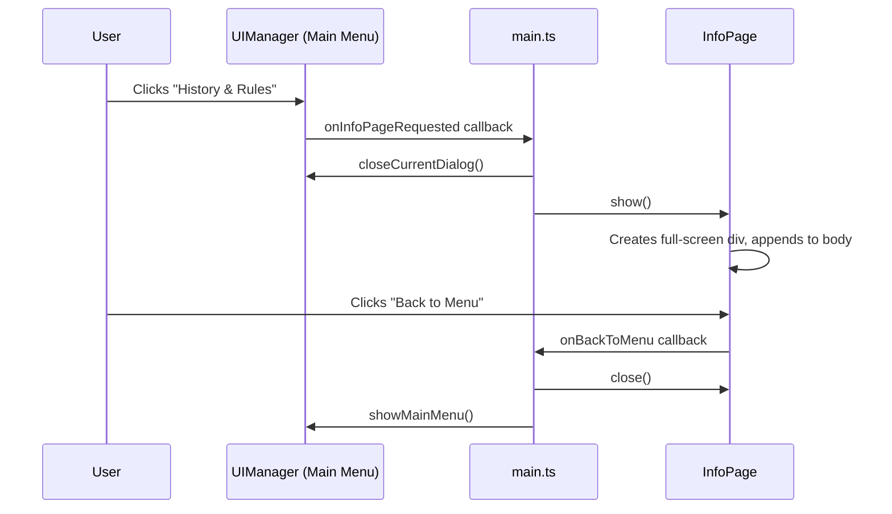

# Design Document: Info Page Redesign

## Overview

This design converts the existing `InfoPage` from an `HTMLDialogElement` modal overlay into a proper full-screen page element integrated with the UIManager navigation flow. The ASCII art `<pre>` diagrams are replaced with `` elements, and a "Back to Menu" button provides navigation back to the main menu.

The redesign touches three areas:
1. The `InfoPage` class itself (DOM structure, lifecycle, callback mechanism)
2. The CSS stylesheet (full-screen layout instead of dialog sizing)
3. The integration wiring in `main.ts` and `UIManager` (close menu before showing page, restore menu on back)

No backend changes are required. The scope is entirely frontend TypeScript, CSS, and static image assets.

## Architecture

The redesigned InfoPage follows a simple component pattern already used throughout the frontend:



Key architectural decisions:

1. **Full-screen `<div>` instead of `<dialog>`**: The page element is a regular `<div>` appended to `document.body` with CSS making it fill the viewport. This avoids the modal overlay behavior of `HTMLDialogElement` and makes the info page feel like a real application screen.

2. **Callback-based navigation**: InfoPage exposes a `setOnBackToMenu(callback)` method. The wiring in `main.ts` connects this to close the info page and re-show the main menu. This keeps InfoPage decoupled from UIManager.

3. **UIManager closes its dialog before InfoPage shows**: The `onInfoPageRequested` handler in `main.ts` calls `uiManager.closeCurrentDialog()` before `infoPage.show()`, ensuring no dialog is open while the info page is displayed.

4. **Image assets as static files**: The three diagram images (board layout, movement, mill example) are placed in `frontend/public/images/` so Vite serves them as static assets. The `` elements reference these paths.

## Components and Interfaces

### InfoPage (Revised)

```typescript
export class InfoPage {
  private pageElement: HTMLDivElement | null = null;
  private onBackToMenu: (() => void) | null = null;

  /** Register callback for when user clicks "Back to Menu". */
  public setOnBackToMenu(callback: () => void): void;

  /** Build and return history section HTML (unchanged content). */
  public getHistoryContent(): string;

  /** Build and return rules section HTML (images replace <pre> diagrams). */
  public getRulesContent(): string;

  /** Create and display the full-screen info page. Removes existing page first if open. */
  public show(): void;

  /** Remove the page element from the DOM. */
  public close(): void;

  /** Returns true if the page element is currently in the DOM. */
  public isOpen(): boolean;
}
```

Changes from current implementation:
- `dialog: HTMLDialogElement` → `pageElement: HTMLDivElement`
- New `onBackToMenu` callback field and setter
- `show()` creates a `<div>` instead of a `<dialog>`, no `showModal()` call
- `close()` removes the div from DOM
- `getRulesContent()` returns `` elements instead of `<pre>` ASCII art
- "Close" button → "Back to Menu" button that fires the callback
- No backdrop click handler (not a dialog)

### main.ts Wiring (Revised)

```typescript
// Current:
uiManager.setOnInfoPageRequested(() => infoPage.show());

// New:
infoPage.setOnBackToMenu(() => {
  infoPage.close();
  uiManager.showMainMenu();
});

uiManager.setOnInfoPageRequested(() => {
  uiManager.closeCurrentDialog();
  infoPage.show();
});
```

### UIManager (No Changes to Class)

UIManager already has `closeCurrentDialog()` and `showMainMenu()`. No new methods needed. The `setOnInfoPageRequested` callback wiring in `main.ts` handles the coordination.

### Static Image Assets

Three image files in `frontend/public/images/`:
- `board-layout.svg` — The 24-position board with three concentric squares
- `piece-movement.svg` — Movement example showing a piece at position 1 with arrows to adjacent positions
- `mill-example.svg` — Three white pieces forming a mill along the top of the outer square

SVG is preferred for these diagrams because they are geometric line drawings that scale cleanly at any resolution and have small file sizes.

## Data Models

No new data models are introduced. The InfoPage is a stateless UI component. Its only state is:
- `pageElement: HTMLDivElement | null` — reference to the DOM element (null when closed)
- `onBackToMenu: (() => void) | null` — navigation callback


## Correctness Properties

*A property is a characteristic or behavior that should hold true across all valid executions of a system — essentially, a formal statement about what the system should do. Properties serve as the bridge between human-readable specifications and machine-verifiable correctness guarantees.*

### Property 1: Diagram elements are well-formed

*For any* rendered InfoPage, there shall be zero `<pre>` elements in the page body, and every `` element with class `info-diagram` shall have a non-empty `alt` attribute describing the diagram content.

**Validates: Requirements 2.1, 2.3**

### Property 2: isOpen reflects DOM state

*For any* sequence of `show()` and `close()` calls on an InfoPage instance, `isOpen()` shall return `true` if and only if the page element is currently present in the DOM.

**Validates: Requirements 3.4**

### Property 3: show is idempotent on DOM element count

*For any* number of consecutive `show()` calls on an InfoPage instance (without intervening `close()` calls), there shall be exactly one info page element in the DOM.

**Validates: Requirements 3.5**

### Property 4: Heading hierarchy is logically ordered

*For any* rendered InfoPage, all heading elements shall follow a logical hierarchy: exactly one `h1` for the page title, `h2` elements for section titles, and `h3` elements for subsection titles, with no heading level skipped (no `h3` without a preceding `h2`).

**Validates: Requirements 4.4**

## Error Handling

Error scenarios for this feature are minimal since InfoPage is a stateless read-only UI component:

1. **Image load failure**: Each `` element has a descriptive `alt` attribute. Browsers natively display alt text when an image fails to load. No additional JavaScript error handling is needed — the `alt` text serves as the fallback (Requirement 2.4).

2. **show() called when already open**: The `show()` method calls `close()` first to remove any existing page element before creating a new one. This prevents duplicate elements in the DOM (Requirement 3.5).

3. **close() called when not open**: The `close()` method checks if `pageElement` is non-null before attempting removal. Calling `close()` on an already-closed page is a no-op.

4. **Back callback not set**: If `onBackToMenu` is null when the back button is clicked, the button click is silently ignored. The page remains open. This is a defensive guard — in practice, `main.ts` always sets the callback before the page can be shown.

## Testing Strategy

### Property-Based Tests

Use `fast-check` (already installed in the project) with Vitest. Each property test runs a minimum of 100 iterations.

- **Property 1 (Diagram well-formedness)**: Generate random sequences of show/close calls, then inspect the DOM for `<pre>` elements and verify all `.info-diagram` images have non-empty `alt` attributes.
  - Tag: `Feature: info-page-redesign, Property 1: Diagram elements are well-formed`

- **Property 2 (isOpen reflects DOM state)**: Generate random sequences of `show()` and `close()` calls. After each call, verify `isOpen()` matches whether the page element exists in the DOM.
  - Tag: `Feature: info-page-redesign, Property 2: isOpen reflects DOM state`

- **Property 3 (show idempotence)**: Generate a random positive integer N (1–20). Call `show()` N times consecutively. Verify exactly one `.info-page` element exists in the DOM.
  - Tag: `Feature: info-page-redesign, Property 3: show is idempotent on DOM element count`

- **Property 4 (Heading hierarchy)**: Generate the page, collect all heading elements, verify the hierarchy rules (one h1, h2s for sections, h3s for subsections, no skipped levels).
  - Tag: `Feature: info-page-redesign, Property 4: Heading hierarchy is logically ordered`

### Unit Tests (Examples and Edge Cases)

Specific example-based tests covering the acceptance criteria not addressed by properties:

- **Requirement 1.1**: Clicking "History & Rules" closes the main menu dialog and shows the info page as a `<div>` (not a `<dialog>`).
- **Requirement 1.3**: The "Back to Menu" button exists in the rendered page.
- **Requirement 1.4**: Clicking "Back to Menu" removes the page from DOM and the main menu is re-shown.
- **Requirement 1.5**: The page contains key history phrases ("1400 BCE", "Egyptian", "merellus") and rules phrases ("Placement", "Movement", "Flying", "mill").
- **Requirement 2.2**: Exactly three `.info-diagram` image elements exist in the rules section.
- **Requirement 2.4** (edge case): When an image fires an `error` event, the `alt` text is still present as fallback.
- **Requirement 2.5**: Three `.info-diagram-caption` elements exist with preserved caption text.
- **Requirement 3.1**: When the info page is displayed, `document.querySelectorAll('dialog[open]')` returns zero elements.
- **Requirement 3.2**: After navigating back, the main menu contains all game mode buttons (Single Player, Local Two Player, Online Multiplayer, Tutorial, History & Rules).
- **Requirement 4.3**: The page container has an `aria-label` attribute.

### Testing Configuration

- Framework: Vitest with jsdom environment
- Property-based testing library: `fast-check` (v4.5.3, already in devDependencies)
- Minimum 100 iterations per property test
- Each property test must include a comment referencing its design document property
- Each correctness property is implemented by a single property-based test

### Test File Organization

- `InfoPage.property.test.ts` — Property-based tests for Properties 1–4
- `InfoPage.content.test.ts` — Update existing content tests (replace ASCII art checks with image checks)
- `InfoPage.integration.test.ts` — Update existing integration tests (dialog → full-screen page, close → back to menu)
